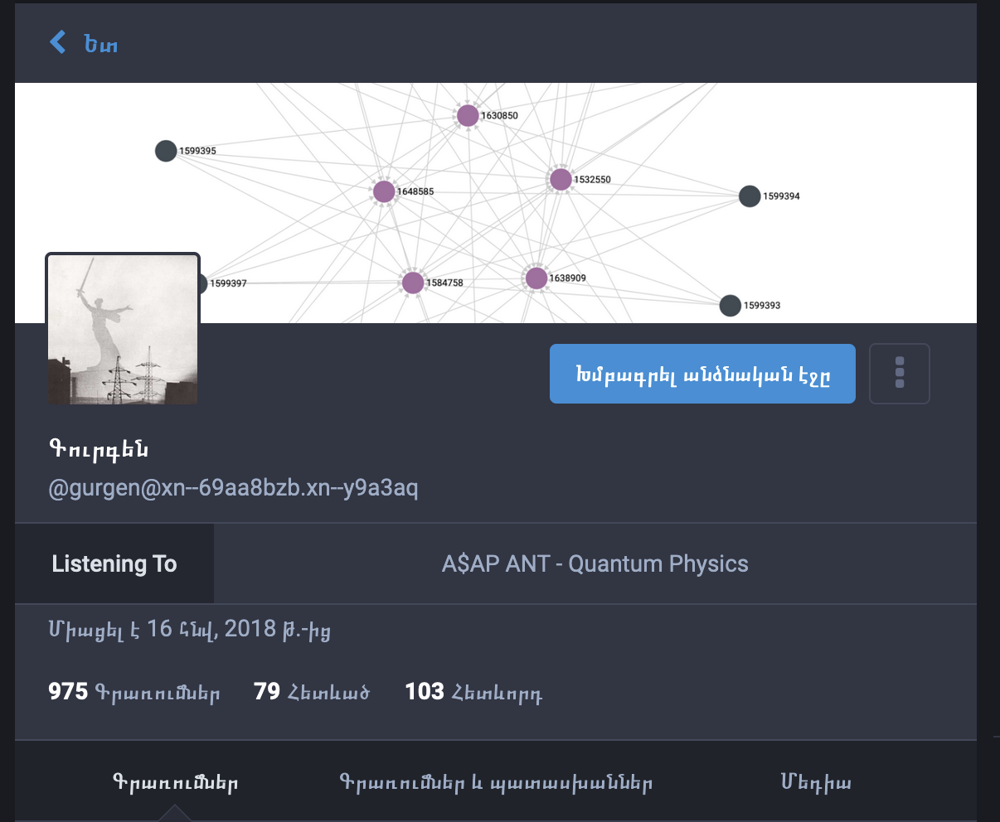

# Spotify To Mastodon

Show your currently playing Spotify track on Mastodon



# Usage

Clone the project and navigate to the project directory.

```sh
$ git clone https://github.com/rasjonell/spotify-to-mastodon
$ cd spotify-to-mastodon
```

Install dependencies

```sh
$ npm install
```

Change the `src/services/spotify.ts` file with your credentials.

```ts
const SpotifyClient = new SpotifyAPI({
  clientId: '<YOUR CLIENT ID>',
  clientSecret: '<YOUR CLIENT SECRET>',
  accessToken: '<YOUR ACCESS TOKEN>',
  refreshToken: '<YOUR REFRESH TOKEN>',
});
```

Change the Mastodon instance URL in `src/index.ts`

```ts
const result = await fetch(
  'https://<YOUR INSTANCE URL>/api/v1/accounts/update_credentials',
  {...}
```

Run the service

```sh
npm run start
```